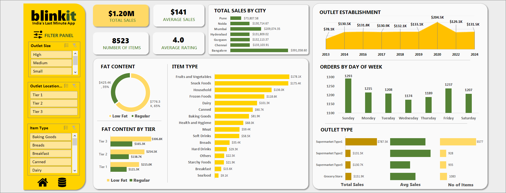

# blinkit-delivery-analysis

## About the Dataset

This project uses a synthetic grocery delivery dataset inspired by quick-commerce platforms like Blinkit. The data includes 8,523 transactions across 10 outlet types spanning from 2011 to 2022, product categories, sales figures, and customer ratings.

**Source**: [Data Tutorials - Blinkit Analysis](https://youtu.be/klZj_282ApY?si=_nx0Glys-Pak1bcS)

**Note:** This is practice data created for learning purposes, not actual Blinkit operational data.

## Data Cleaning

- Removed Duplicates & unnecessary Columns using Power Query
- Identified 10 unique outlet identifiers
- Corrected outlet establishment years (added +2 to align with Blinkit's actual founding year i.e., 2013)
- Created a new sheet 'Locality' with geographic data and merged to the dataset using VLOOKUP
- Created day-of-week column to analyze order patterns

## Data Quality Notes

The dataset contains some logical inconsistencies (e.g., outlet establishment years predating the company's founding). This reinforces that the data is synthetic and created for educational purposes. In a real business scenario, these would be flagged and corrected during data validation.

## Key Insights
- **City Performance**: Bangalore generates $391K in sales (33% of total), significantly outperforming other metros
- **Tier Strategy**: Tier 3 outlets generate higher performance compared to Tier 1 locations
- **Product Mix**: Fruits/vegetables, snacks, and household items drive 40% of total sales
- **Quality vs Volume**: OUT019 achieves highest customer rating (4.0) with lowest sales volume (528 orders), indicating a quality-focused niche model
- **Demand Patterns**: Order frequency remains consistent across weekdays (~1,200 orders), with slight peak on Sunday

## Business Recommendations
- Ensure fruits/vegetables, snacks, and household essentials never stock out (primary revenue drivers)
- Prioritize medium-sized outlets in Tier 2/3 cities where per-location performance is strongest
- Investigate Bangalore's success factors and replicate in other metros
- Analyze OUT019's quality-focused model for potential premium segment expansion

## Tools & Skills Demonstrated
- **Excel**: Pivot Tables, Slicers, Interactive Dashboards, Data Visualization
- **Data Cleaning**: Power Query for transformation and validation
- **Analysis**: VLOOKUP, performance benchmarking, pattern identification
  

## Files
- `dataset.xlsx` - Raw Dataset
- `BlinkIt Grocery Data Analysis.xlsx` - Excel Worksheet with Pivot Tables and Interactive Dashboard
- `Dashboard.png` - Excel dashboard
- `README.md` - Project documentation

## Future Scope
This analysis focuses on foundational insights. Future iterations could integrate data from other Zomato/Eternal subsidiaries (Hyperpure, District) for cross-platform analysis and deeper business intelligence.

"Build something imperfect today rather than planning something perfect for tomorrow"

